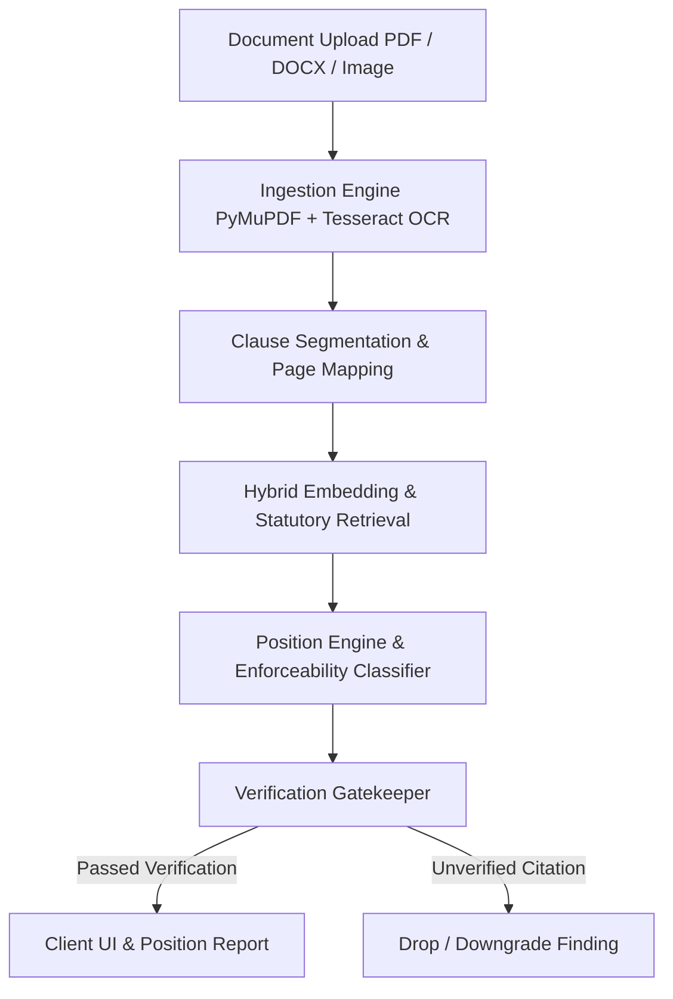

# FinePrint — Legal AI Assistant
### *Grounded Position Reports for Employment Contracts, Bonds & Agreements under Indian Law*

[](https://fineprint-796201743154.asia-south1.run.app)
[](https://fineprint-796201743154.asia-south1.run.app/api/health)
[](https://fastapi.tiangolo.com/)
[](https://vitejs.dev/)

> **Live Production URL:** [https://fineprint-796201743154.asia-south1.run.app](https://fineprint-796201743154.asia-south1.run.app)  
> **Built for:** Hack2Skills PromptWars — AI Evolution Module

---

## 📌 Executive Summary

**FinePrint** is a specialized, production-ready GenAI legal assistant engineered to analyze complex employment offer letters, service bonds, and employment agreements. 

Most AI tools simply summarize contracts. **FinePrint does not summarize — it generates a structured Position Report.** It tells candidates, employees, and tenants exactly **where they stand**, what they are bound to do, what clauses are aggressive or unusual compared to industry baselines, and which terms are legally unenforceable under statutory Indian law.

---

## ⚖️ The Problem & The Solution

| The Challenge | How FinePrint Solves It |
|---|---|
| **Asymmetric Power** | Employers and landlords use standard templates with restrictive clauses that individuals sign without understanding their implications. |
| **Summarization vs. Position** | A summary says *"Section 4 mentions a non-compete"*. A Position Report says *"This restricts your livelihood for 2 years post-exit, which is void under Section 27 of the Indian Contract Act."* |
| **AI Hallucinations in Law** | LLMs tend to invent legal precedents or confirm facts not in the document. FinePrint enforces **strict grounded retrieval** and explicitly **abstains** when information is absent. |
| **Actionability Gap** | Users don't know what to do next. FinePrint provides concrete redline proposals, negotiation email drafts, and a one-page **Lawyer Prep Brief PDF**. |

---

## 🚀 Core Features (5 Outputs from One Upload)

### 1. 📅 Obligations Timeline
- Extracts all commitments required of the user (e.g., notice period, asset return, training bond duration, confidentiality).
- Explicitly structures **Who**, **What**, **Due Date/Timeline**, **Trigger Event**, and **Financial Penalty (INR)**.
- Every obligation is anchored with exact character-span citations to the source text.

### 2. 📊 Market Baseline Engine ("Is This Normal?")
- Benchmarks every clause against a curated database of 40+ standard Indian employment and rental baselines.
- Categorizes each term:
  - 🟢 **Standard** (within standard market tolerance)
  - 🟡 **Stricter Than Usual** (e.g., 90-day notice period with no buyout clause)
  - 🔴 **Unusual / High Risk** (e.g., 3-year post-termination non-compete, blanket indemnity)

### 3. ⚖️ Enforceability & Indian Statutory Risk Flags
- Evaluates clauses against key Indian legal provisions and Supreme Court / High Court doctrines:
  - **Section 27, Indian Contract Act, 1872**: Restraint of trade / post-employment non-compete restrictions are void *ab initio*.
  - **Section 74, Indian Contract Act, 1872**: Liquidated damages & training bonds must represent genuine pre-estimates of actual training expenses, not punitive penalties.
  - **Specific Relief Act, 1963 (Sections 14 & 41)**: Contracts of personal service cannot be specifically enforced by injunction.
  - **State Shops & Establishments Acts**: Statutory minimums for notice periods, leave encashment, and overtime.

### 4. ✍️ "Your Move" (Redlines & Negotiation Email)
- Generates precise redlines for oppressive clauses (e.g., replacing punitive bond forfeiture with reasonable amortized training cost reimbursement).
- Drafts a courteous, professional negotiation email ready to send to HR or the hiring manager.

### 5. 📄 Lawyer Prep Brief (ReportLab PDF)
- Compiles an executive one-page briefing document designed for a user to hand directly to their legal counsel.
- Highlights high-risk clauses, applicable statutes, and formulated questions to ask a lawyer.

### 6. 💬 Grounded Q&A with Strict Abstention
- Interactive document interrogation with **hybrid lexical-semantic search**.
- Strict abstention guardrails: if a query cannot be answered directly from the document content, the system safely responds:
  > *"This document does not contain information to answer that question."*
  with **zero hallucinated citations**.

---

## 🛡️ Anti-Hallucination & Verification Architecture

FinePrint implements a strict 3-tier citation hierarchy and verification pipeline:



### Verification Rules
1. **Tier 1 (Document Says)**: Findings must quote exact, verifiable character offsets from the uploaded text.
2. **Tier 2 (General Law)**: Explanations citing statutory law must map to verified statutes in the statute corpus.
3. **Tier 3 (Actionable Options)**: Must never use mandatory language (*"you must"*, *"do this"*). Only non-directive guidance (*"consider discussing"*, *"one option is"*).
4. **Gatekeeper Drop Rule**: If an LLM-generated finding references a quote not matching the original document byte-for-byte, it is automatically discarded.

---

## 🏗️ System Architecture & Tech Stack

```
fineprint/
├── backend/                  # FastAPI Application
│   ├── main.py              # REST API & SPA Static Serving
│   ├── schemas.py           # Pydantic v2 Contract Specifications
│   ├── db.py                # SQLite Document & Analysis Store
│   ├── ingestion/           # OCR (Tesseract), PyMuPDF, DOCX Parser
│   ├── segment/             # Clause Segmentation & Boundary Detection
│   ├── analyze/             # Baseline Matching & Statutory Evaluator
│   ├── qa/                  # Grounded Q&A with Hybrid Abstention
│   ├── outputs/             # ReportLab PDF Brief & Redline Generator
│   └── llm/                 # Provider-agnostic LLM & Embedding Client
├── frontend/                 # React 19 Single Page Application
│   ├── src/components/      # Document Viewer, Clause Inspector, Q&A Panel
│   ├── src/index.css        # Tailwind CSS v4 Design Tokens & Typography
│   └── vite.config.ts       # Vite Build Configuration
├── data/
│   ├── baselines/           # Curated Market Standards Corpus
│   └── statutes/            # Verified Indian Statutory & Precedent DB
├── tests/                    # 38 Automated Unit & Integration Tests
├── Dockerfile                # Multi-stage Containerization
└── .gcloudignore             # Deployment Optimization Manifest
```

### Technology Matrix
- **Backend API**: Python 3.11, FastAPI 0.115, Uvicorn, Pydantic v2
- **Document Processing**: PyMuPDF 1.25, Tesseract OCR 5, Pillow, OpenCV Headless, python-docx
- **Embeddings & Search**: `sentence-transformers` (all-MiniLM-L6-v2) + BM25 Lexical Scoring
- **Report Generation**: ReportLab 4.2 PDF Generator
- **Frontend SPA**: React 19, TypeScript, Vite 8, Tailwind CSS v4, Lucide Icons
- **Database**: SQLite3 (zero-dependency embedded relational storage)
- **Deployment Platform**: Google Cloud Run (Serverless Container in `asia-south1` Mumbai)

---

## ☁️ Google Cloud Deployment Architecture

FinePrint is packaged as a lightweight, multi-stage container and deployed to **Google Cloud Run**:

```dockerfile
# Multi-stage: Frontend build -> Python slim runner
FROM node:20-slim AS frontend-builder
WORKDIR /build/frontend
COPY frontend/package*.json ./ && RUN npm ci
COPY frontend/ ./ && RUN npm run build

FROM python:3.11-slim
WORKDIR /app
RUN apt-get update && apt-get install -y --no-install-recommends \
    tesseract-ocr tesseract-ocr-eng libgl1 libglib2.0-0 curl
COPY requirements.txt ./ && RUN pip install --no-cache-dir -r requirements.txt
COPY backend/ ./backend/
COPY data/ ./data/
COPY fixtures/ ./fixtures/
COPY --from=frontend-builder /build/frontend/dist ./frontend/dist
CMD ["sh", "-c", "uvicorn backend.main:app --host 0.0.0.0 --port ${PORT:-8080}"]
```

### Production Parameters
- **Service Name**: `fineprint`
- **Region**: `asia-south1` (Mumbai)
- **Memory**: 2 GiB
- **CPU**: 2 vCPU
- **Concurrency**: 80 requests/container
- **Autoscaling**: 0 to 10 instances (scale-to-zero enabled for maximum efficiency)

---

## 🔌 API Reference

### 1. Upload Document
```http
POST /api/documents
Content-Type: multipart/form-data

file: [PDF, DOCX, TXT, or Image file]
```
**Response:**
```json
{
  "document_id": "doc-16524823",
  "full_text": "EMPLOYMENT AGREEMENT...",
  "pages": [{"page_no": 0, "start": 0, "end": 173}]
}
```

### 2. Generate Position Report
```http
POST /api/documents/{document_id}/analyze
Content-Length: 0
```
**Response:** Full Position Report including `clauses`, `baseline_verdicts`, `enforceability_flags`, `obligations`, and `findings`.

### 3. Ask Grounded Question
```http
POST /api/documents/{document_id}/ask
Content-Type: application/json

{
  "question": "What is the notice period required upon resignation?"
}
```
**Response:**
```json
{
  "answer": "According to the agreement: 2. Notice Period: 90 days notice required.",
  "citations": [{"kind": "document", "quote": "2. Notice Period: 90 days notice required."}],
  "abstained": false
}
```

### 4. Generate Redlines & Negotiation Email
```http
POST /api/documents/{document_id}/redline
Content-Length: 0
```
**Response:** Clause-by-clause suggested modifications with statutory rationales and a customizable negotiation email.

### 5. Download Lawyer Brief PDF
```http
GET /api/documents/{document_id}/brief.pdf
```
**Response:** Binary `%PDF-1.4` ReportLab stream.

---

## 🧪 Testing & Verification Suite

The repository includes a comprehensive 38-case test suite covering parser integrity, statutory classification, citation verification, and grounded abstention:

```bash
python -m pytest tests/ -v
```

```
============================== test session starts ==============================
collected 38 items

tests/test_abstention.py::test_5_unanswerable_questions_abstain_via_api PASSED
tests/test_abstention.py::test_answer_pipeline_direct_abstention PASSED
tests/test_baseline.py::test_baseline_corpus_integrity PASSED
tests/test_baseline.py::test_no_baseline_fallback PASSED
tests/test_classify.py::test_valid_classification PASSED
tests/test_classify.py::test_risk_score_clamping PASSED
tests/test_fixtures.py::TestAnalysisFixture::test_parses_as_analysis_response PASSED
tests/test_fixtures.py::TestAnalysisFixture::test_non_compete_flagged PASSED
tests/test_fixtures.py::TestQAFixture::test_abstained_responses_have_no_citations PASSED
tests/test_ingestion.py::test_extract_pdf PASSED
tests/test_ingestion.py::test_extract_docx PASSED
tests/test_pdf.py::test_generate_brief_pdf_creates_valid_file PASSED
tests/test_segmentation.py::test_segment_offer_letter PASSED
tests/test_statute_loading.py::test_non_compete_statute_enforceability PASSED
tests/test_verify.py::test_corrupted_citation_dropped PASSED
tests/test_verify.py::test_imperative_detection PASSED
tests/test_verify.py::test_imperative_in_option_tier_dropped PASSED
...
======================= 38 passed, 0 failures in 1.73s =======================
```

---

## 💻 Local Development Setup

### 1. Prerequisites
- Python 3.11+
- Node.js 20+
- Tesseract OCR (`tesseract` in system PATH)

### 2. Installation
```bash
# Clone the repository
git clone https://github.com/your-username/fineprint.git
cd fineprint

# Backend setup
cd backend
python -m venv .venv
source .venv/bin/activate  # Or on Windows: .venv\Scripts\activate
pip install -r ../requirements.txt

# Start backend server
uvicorn main:app --reload --port 8000
```

```bash
# Frontend setup
cd ../frontend
npm install
npm run dev
```

Visit `http://localhost:5173` to interact with the local development instance.

---

## ⚖️ Legal Disclaimer
**FinePrint provides legal information and educational analysis, not legal representation or advice.** Legal interpretations depend on specific facts, jurisdiction, and changing case law. Users should always consult a licensed advocate or legal practitioner before executing or disputing legal agreements.

---

## 📜 Credits & Hackathon Submission
- **Project**: FinePrint — Legal AI Assistant
- **Competition**: Hack2Skills PromptWars (Top Participants AI Evolution Module)
- **Author**: Mohit & Veer Prajapati
- **Live Cloud URL**: [https://fineprint-796201743154.asia-south1.run.app](https://fineprint-796201743154.asia-south1.run.app)
